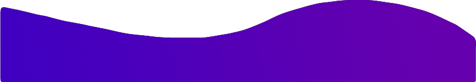

<p align="center">
  
</p>

<p align="center">
  
</p>

```python
#!/usr/bin/python
# -*- coding: utf-8 -*-


class DataAnalyst:

    def __init__(self):
        self.name = "Stefan Vuleta"
        self.role = "Data Analyst"
        self.language_spoken = ["en_US", "hr_BA", "sr_BA"]

    def say_hi(self):
        print("Thanks for dropping by, hope you find some of my work interesting.")


me = DataAnalyst()
me.say_hi()
```

[](https://github.com/stefanalytical)

## 🔧 Technologies & Tools


## 👨‍🎓 Education and Certificates

- University of Louisville (BSBA in CIS — Data Analytics) - Graduatin December 2023
- Code Louisville (Data Analytics 1)
- Code Louisville (Data Analytics 2)
- Code Louisville (QA Analytics 1) - Currently enrolled

<p align="center">
  
</p>


